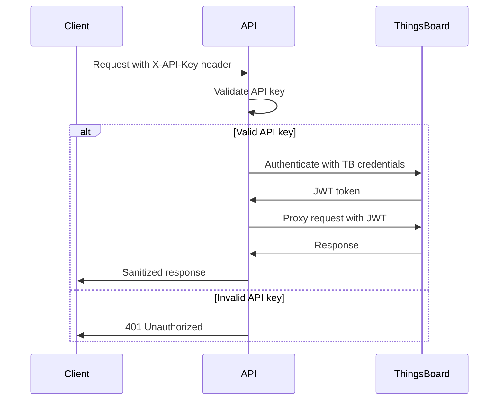
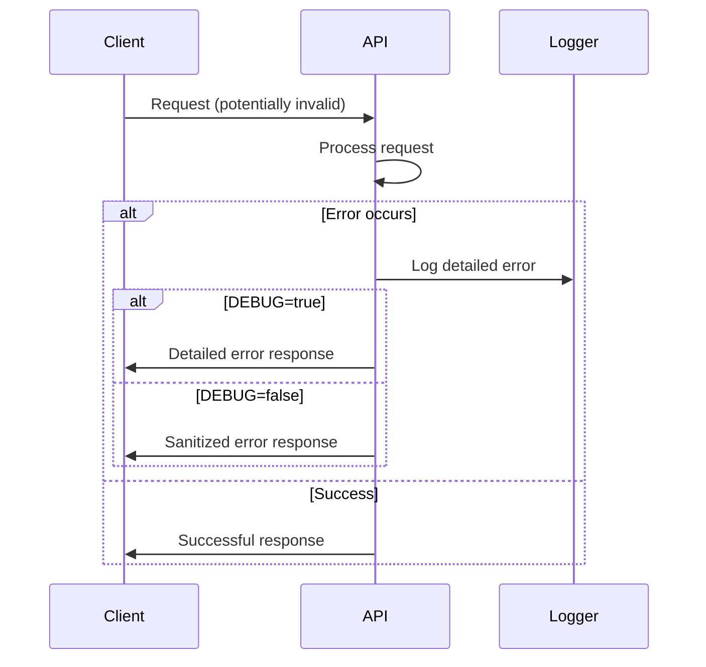

# Security Configuration Guide

## 🔒 Overview

TB-API-SDK follows security best practices with **defense-in-depth** approach including:
- Environment-driven configuration with no hardcoded credentials
- API key authentication for endpoint protection
- Rate limiting to prevent abuse
- Comprehensive security headers
- Sanitized error handling
- Request logging and monitoring

## ⚙️ Enhanced Security Configuration

### Environment Variables

All sensitive configuration is managed through environment variables:

```bash
# Required ThingsBoard Configuration
TB_HOST=https://your-thingsboard-host.com  # Use HTTPS in production
TB_USERNAME=your-username@domain.com  
TB_PASSWORD=your-secure-password

# API Security Settings
API_KEY=your-secret-api-key-here  # Generate strong random key
SECRET_KEY=your-jwt-secret-key    # For JWT/session signing
DEBUG=false  # NEVER enable in production

# Network Security
ALLOWED_HOSTS=your-domain.com,api.your-domain.com
BACKEND_CORS_ORIGINS=https://your-frontend.com,https://admin.your-domain.com

# Rate Limiting  
RATE_LIMIT_REQUESTS=100  # Requests per minute per IP
RATE_LIMIT_WINDOW=60     # Window in seconds

# Optional Project Settings
PROJECT_NAME=TB-API-SKD
VERSION=0.1.0
```

### New Security Features

#### 1. API Key Authentication
All endpoints now require API key authentication via `X-API-Key` header:

```bash
curl -H "X-API-Key: your-secret-api-key" \
     https://api.yourdomain.com/api/v1/tb/devices
```

#### 2. Rate Limiting
- **100 requests per minute per IP** (configurable)
- Sliding window implementation
- Returns `429 Too Many Requests` when exceeded
- Includes `Retry-After` headers

#### 3. Security Headers
Automatically applied to all responses:
- `X-Content-Type-Options: nosniff`
- `X-Frame-Options: DENY`
- `X-XSS-Protection: 1; mode=block`
- `Strict-Transport-Security` (HTTPS only)
- `Content-Security-Policy` with Swagger UI support:
  - `default-src 'self'` - Only same-origin resources by default
  - `script-src 'self' 'unsafe-inline' https://cdn.jsdelivr.net` - Allow Swagger UI scripts
  - `style-src 'self' 'unsafe-inline' https://cdn.jsdelivr.net` - Allow Swagger UI styles
  - `img-src 'self' data: https://fastapi.tiangolo.com https://cdn.jsdelivr.net` - Allow Swagger UI images
  - `font-src 'self' https://cdn.jsdelivr.net` - Allow Swagger UI fonts
  - `connect-src 'self'` - Only same-origin AJAX/WebSocket connections

#### 4. CORS Security
- **No more wildcard origins** with credentials
- Explicit allowed methods and headers
- Configurable trusted origins only

#### 5. Error Sanitization
- Generic error messages in production
- Detailed errors only in debug mode
- Full error logging for debugging
- No internal system information exposure

## 🛡️ Production Security Checklist

### Required Configuration
- [ ] **HTTPS Only**: `TB_HOST=https://...`
- [ ] **Strong API Key**: Generate 32+ character random key
- [ ] **Debug Disabled**: `DEBUG=false`
- [ ] **Allowed Hosts**: Configure specific domains
- [ ] **CORS Origins**: List only trusted frontend domains
- [ ] **Rate Limits**: Adjust based on expected traffic

### API Key Generation
```bash
# Generate secure API key for your .env file
python -c "import secrets; print('API_KEY=' + secrets.token_urlsafe(32))"

# Or using openssl (add API_KEY= prefix manually)
openssl rand -base64 32
```

### Docker Security
```yaml
# docker-compose.yml - Production example
services:
  tb-api-sdk:
    build: .
    environment:
      - TB_HOST=https://thingsboard.company.com
      - TB_USERNAME=${TB_USERNAME}
      - TB_PASSWORD=${TB_PASSWORD}
      - API_KEY=${API_KEY}
      - DEBUG=false
      - ALLOWED_HOSTS=api.company.com
      - BACKEND_CORS_ORIGINS=https://dashboard.company.com
    restart: unless-stopped
    networks:
      - internal
    labels:
      - "traefik.enable=true"
      - "traefik.http.routers.tb-api.tls=true"
```

## 🔍 Security Monitoring

### Automatic Logging
The API automatically logs:
- **Authentication failures** (401, 403)
- **Rate limit violations** (429) 
- **ThingsBoard connection errors**
- **Validation errors**
- **Internal server errors**

### Security Events
Monitor these log patterns:
```bash
# Authentication failures
grep "Security event: 401" app.log

# Rate limiting
grep "Rate limit exceeded" app.log

# ThingsBoard connection issues  
grep "ThingsBoard HTTP error" app.log
```

### Health Monitoring
```bash
# Check API health
curl https://api.yourdomain.com/api/v1/health

# Check rate limit headers
curl -I -H "X-API-Key: your-key" \
     https://api.yourdomain.com/api/v1/tb/devices
```

## 🚨 Security Incident Response

### If API Key is Compromised:
1. **Immediately generate new API key**:
   ```bash
   python -c "import secrets; print('API_KEY=' + secrets.token_urlsafe(32))"
   ```
2. **Update environment variables**
3. **Restart the application**
4. **Monitor logs** for unauthorized access
5. **Audit recent API calls**

### If Rate Limiting is Triggered:
1. **Check logs** for source IPs
2. **Verify legitimate vs. malicious traffic**
3. **Adjust rate limits** if needed
4. **Consider IP blocking** for persistent abuse

### If ThingsBoard Credentials are Compromised:
1. **Change ThingsBoard password immediately**
2. **Update `TB_PASSWORD` environment variable**
3. **Restart the application**
4. **Check ThingsBoard audit logs**
5. **Rotate any related credentials**

## 🔐 Authentication Flows

### API Key Authentication


### Error Handling Flow


## 📋 Updated Security Validation

### Configuration Tests
```bash
# Test ThingsBoard connection
python tb_connection_check.py

# Verify security headers
curl -I https://api.yourdomain.com/

# Test rate limiting
for i in {1..150}; do curl -H "X-API-Key: test" \
    https://api.yourdomain.com/api/v1/health; done

# Test authentication
curl https://api.yourdomain.com/api/v1/tb/devices  # Should return 401
curl -H "X-API-Key: wrong-key" \
    https://api.yourdomain.com/api/v1/tb/devices     # Should return 401
curl -H "X-API-Key: correct-key" \
    https://api.yourdomain.com/api/v1/tb/devices     # Should work
```

### Integration Tests
All existing pytest tests have been enhanced with security validation:
- API key requirement testing
- Rate limiting verification  
- Error response sanitization
- Security header validation

## 📞 Security Support

For security questions or incidents:
- **Configuration issues**: Review this documentation
- **API key management**: Use secure generation methods
- **Rate limiting**: Monitor logs and adjust settings
- **Error investigation**: Check sanitized logs
- **ThingsBoard integration**: Verify credentials and connectivity

---

**Security is a continuous process. Regularly review logs, update dependencies, and monitor for security advisories!** 🔒 